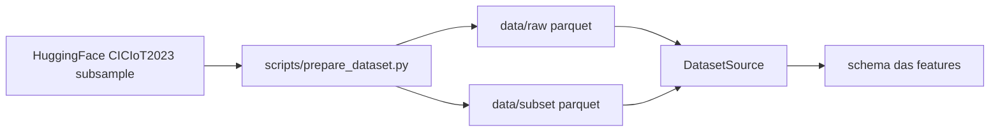
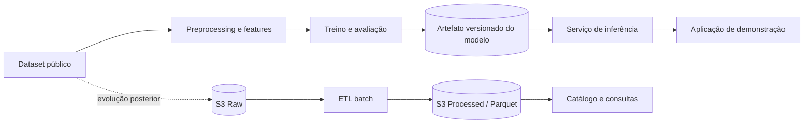

# NetGuard ML — Detecção de Ataques em Redes

Projeto de portfólio para detectar tráfego de rede suspeito com Machine Learning e, progressivamente, aplicar práticas de Data Engineering na AWS.

O objetivo inicial é classificar cada observação em uma das duas classes abaixo:

- `normal`
- `attack`

O projeto prioriza uma evolução verificável: primeiro um pipeline de ML reproduzível e avaliado; depois, quando houver uma necessidade arquitetural real, Data Lake, processamento batch, inferência e streaming.

> **Status atual:** dataset oficial definido (CICIoT2023 subsample HuggingFace, `random_3way`), leitura local de parquet/CSV/TSV/JSON e inspeção do schema das features. Ainda não há modelo treinado, infraestrutura AWS, API ou dashboard.

Para subir o ambiente e rodar o que já existe, siga o [tutorial de execução](docs/como-executar.md).

## Problema

Ataques podem alterar padrões de tráfego, como taxas de pacotes, volume de bytes, duração de conexões, taxas de erro e mensagens ICMP. O NetGuard ML investigará se essas características permitem distinguir comportamento normal de comportamento sob ataque.

O Internet Control Message Protocol (ICMP) faz parte do escopo: é usado para relatório de erros de rede, diagnóstico (`ping` / `traceroute`) e também aparece em ataques como inundação por ping (ICMP flood). Features candidatas incluem tipo e código ICMP, taxa de echo request/reply, latência de ping e mensagens de erro ICMP. O target permanece binário (`normal` / `attack`); um tipo específico como ICMP flood só será exibido se o modelo tiver sido treinado e avaliado para isso.

Accuracy não será usada isoladamente: o projeto dará atenção especial ao recall da classe `attack`, aos falsos negativos e aos falsos positivos.

## Arquitetura atual

Não há serviço implantado. O que existe localmente é o download do subsample, a leitura tabular e a inspeção do schema das features.



## Arquitetura planejada

Esta arquitetura é uma visão de evolução; seus componentes não estão implementados nesta etapa.



## Tecnologias

| Área | Atual | Planejado, quando necessário |
| --- | --- | --- |
| Linguagem e dados | Python 3.12, uv, Polars | NumPy e SQL |
| Machine Learning | Não implementado | scikit-learn; possível XGBoost e SHAP |
| Armazenamento analítico | Não implementado | Amazon S3, Parquet, AWS Glue Data Catalog e Athena |
| Orquestração batch | Não implementado | Scripts Python; Step Functions somente se a complexidade justificar |
| Infraestrutura | Não implementada | Terraform, IAM e recursos AWS necessários por fase |
| Inferência e aplicação | Não implementado | FastAPI, backend TypeScript e React/Next.js após validação do ML |
| Streaming e observabilidade | Não implementado | Kinesis e CloudWatch após o pipeline batch e a inferência |

## Status atual

- [x] Selecionar e documentar um dataset público de tráfego de rede, preferencialmente com tráfego ICMP e rótulos que permitam mapear ataques ICMP (ex.: ping flood) para a classe `attack` — ver [docs/dataset.md](docs/dataset.md)
- [x] Baixar o subsample, ler os splits e inspecionar o schema das features
- [ ] Realizar análise exploratória e definir o target binário
- [ ] Implementar preprocessing reproduzível
- [ ] Treinar e avaliar o baseline com Decision Tree
- [ ] Comparar Random Forest e boosting
- [ ] Exportar o modelo e o preprocessing versionados
- [ ] Evoluir para Data Engineering na AWS
- [ ] Criar inferência, streaming e dashboard

## Pipeline de dados

O download e a leitura dos splits já publicados (`train` / `validation` / `test`) estão implementados. Limpeza, features de modelo e treino ainda não.

```text
data/raw/ciciot2023-neto-subsample → validação → limpeza → features → treino/validação/teste
```

A divisão deverá evitar vazamento de dados. Se o dataset não tiver tempo real ou grupos confiáveis (por exemplo, host, sessão ou captura), a ordem das linhas não será usada como informação temporal. Janelas temporais só serão avaliadas se houver timestamps e uma sequência temporal significativa.

Posteriormente, o mesmo fluxo poderá evoluir para um Data Lake:

```text
Dataset → S3 Raw → transformação batch → S3 Processed (Parquet) → Glue Catalog → Athena
```

Consulte o [roadmap AWS](docs/aws-roadmap.md) para os critérios de entrada e o escopo de cada fase.

## Pipeline de Machine Learning

O experimento seguirá a sequência abaixo, com a mesma estratégia de divisão para todos os modelos:

```text
Decision Tree (baseline) → Random Forest → Boosting → comparação → seleção → exportação
```

As métricas incluirão accuracy, precision, recall, F1-score, false positive rate, false negative rate, matriz de confusão e tempos de treinamento e inferência. O artefato escolhido deverá incluir ou referenciar de forma versionada o preprocessing usado no treino.

## Arquitetura AWS

AWS não faz parte da arquitetura atual. Ela será introduzida apenas depois que o pipeline local estiver funcional, reproduzível e avaliado.

As fases previstas são:

1. Data Lake com S3, Glue Data Catalog e Athena;
2. processamento batch, validação e transformação;
3. integração entre pipeline de dados e treinamento de ML;
4. streaming com Kinesis, após a inferência estar validada;
5. observabilidade com CloudWatch.

A infraestrutura será provisionada preferencialmente com Terraform, sem antecipar recursos ou arquivos ainda não utilizados. Veja os detalhes em [Roadmap de Data Engineering e AWS](docs/aws-roadmap.md).

## Resultados

Ainda não há resultados experimentais. Esta seção passará a registrar, a cada experimento relevante:

- dataset e versão utilizados;
- definição de target e features;
- estratégia de divisão e avaliação de vazamento;
- métricas por modelo;
- análise de falsos positivos e falsos negativos;
- decisão e limitações conhecidas.

## Roadmap

| Marco | Entrega | Estado |
| --- | --- | --- |
| v0.1.0 | Dataset, preprocessing e baseline de ML | Pendente |
| v0.2.0 | Comparação de modelos e análise de erros | Pendente |
| v0.3.0 | Data Lake na AWS | Pendente |
| v0.4.0 | Pipeline batch de dados | Pendente |
| v0.5.0 | Inferência em tempo real | Pendente |
| v1.0.0 | Demonstração integrada | Pendente |

Releases serão criadas apenas quando esses marcos tiverem entregas verificáveis.

## Como executar localmente

Tutorial completo (pré-requisitos, saída esperada e problemas comuns): **[docs/como-executar.md](docs/como-executar.md)**.

Resumo — todos os comandos na **raiz do repositório**. Python **3.12+** e [uv](https://docs.astral.sh/uv/). Não ative `.venv` na mão; use `uv run`.

```bash
git clone https://github.com/g-tavares14/netguard-ml.git
cd netguard-ml

# macOS / Linux
curl -LsSf https://astral.sh/uv/install.sh | sh
source "$HOME/.local/bin/env"
# Windows (PowerShell): irm https://astral.sh/uv/install.ps1 | iex

uv sync
uv run python scripts/prepare_dataset.py
uv run python -m netguard_ml.data.main
uv run python -m netguard_ml.data.main data/subset/ciciot2023_subset.parquet
uv run pytest tests/ -q
```

O `main` sem argumentos lê os parquet em `data/raw/ciciot2023-neto-subsample/`. O script de preparação também gera `data/subset/ciciot2023_subset.parquet` (recorte do `train` para EDA). Os testes (15, hoje) não precisam desses arquivos.

Ainda não há comando de treino, inferência ou dashboard.

> **Atenção:** Datasets, ambientes virtuais, credenciais e artefatos de modelo estão no `.gitignore` e não devem ser commitados.


## Infraestrutura

Não há recursos AWS nem código Terraform no repositório neste momento. Quando a fase de Data Lake for iniciada, a infraestrutura será adicionada incrementalmente em `infra/terraform/`, somente com os arquivos necessários à entrega corrente.

## Documentação

- [Como executar](docs/como-executar.md): ambiente, download do dataset, inspeção de schema e testes.
- [Dataset oficial](docs/dataset.md): CICIoT2023 (subsample HuggingFace), splits, rótulos e citação.
- [Escopo inicial do projeto](docs/escopo-inicial.md): objetivos, estratégia experimental, métricas e arquitetura de demonstração.
- [Roadmap de Data Engineering e AWS](docs/aws-roadmap.md): critérios e evolução planejada para Data Lake, batch, streaming e observabilidade.
- [Diretrizes para agentes](AGENTS.md): regras de execução e ordem técnica do projeto.

## Referências acadêmicas

- https://aws.amazon.com/pt/what-is/icmp/
- https://www.rfc-editor.org/rfc/rfc792
- https://www.rfc-editor.org/rfc/rfc4443
- https://www.unb.ca/cic/datasets/iotdataset-2023.html
- https://huggingface.co/datasets/lacg030175/CIC-IoT-2023-neto-subsample
- https://www.mdpi.com/1424-8220/23/13/5941
- https://www.unb.ca/cic/datasets/nsl.html
- https://www.unb.ca/cic/datasets/ids-2017.html
- https://www.unb.ca/cic/datasets/ids-2018.html
- https://www.unb.ca/cic/datasets/ddos-2019.html
- https://research.unsw.edu.au/projects/unsw-nb15-dataset
- https://ieeexplore.ieee.org/document/10292643
- https://www.sciencedirect.com/science/article/pii/S2665963826000096
- https://www.tandfonline.com/doi/full/10.1080/03772063.2023.2208549
- https://www.mdpi.com/2073-431x/14/7/282

## Próxima entrega

`[Data] Exploratory analysis of CICIoT2023 subsample`: EDA em `data/raw/ciciot2023-neto-subsample/`, mapeamento `label` → `normal`/`attack`, features utilizáveis e risco de vazamento nos splits publicados.
