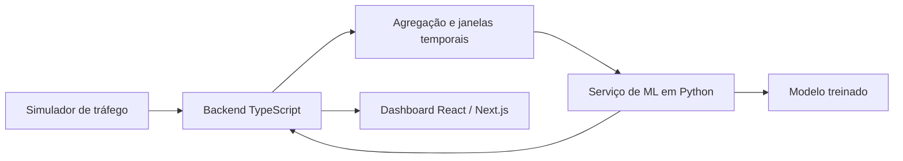

# NetGuard ML — Predição e Detecção de Ataques em Redes

Sistema para analisar métricas de tráfego de rede e classificar o estado da rede em duas categorias iniciais:

- **Normal**
- **Sob ataque**

O projeto combina experimentação em Machine Learning e engenharia de software. Além de treinar um classificador, a proposta é comparar diferentes modelos, investigar o comportamento temporal do tráfego, explicar as predições e demonstrar o resultado em um painel atualizado em tempo real.

> **Status:** planejamento e seleção do dataset.

## Objetivos

- Construir um pipeline reproduzível de preparação, treinamento e avaliação.
- Usar uma Decision Tree como baseline e compará-la com Random Forest e boosting.
- Avaliar os modelos além da accuracy, com atenção especial a falsos negativos.
- Explorar janelas temporais somente se o dataset possuir ordenação temporal significativa.
- Expor o modelo treinado por meio de uma API e demonstrar as predições em tempo real.
- Explicar quais características mais influenciaram cada resultado.

## Arquitetura proposta

O backend TypeScript será responsável pelo fluxo da aplicação, enquanto o serviço Python concentrará treinamento e inferência. Essa separação busca delimitar responsabilidades e permitir evolução futura, não introduzir infraestrutura distribuída antes que o pipeline de ML esteja validado.

## Estratégia experimental

1. Escolher e estudar o dataset.
2. Definir target, features e metodologia de divisão dos dados.
3. Implementar uma Decision Tree como baseline.
4. Treinar Random Forest e um modelo de boosting.
5. Comparar qualidade preditiva, tempo de treinamento e tempo de inferência.
6. Investigar análise temporal e explicabilidade.
7. Empacotar o modelo selecionado em uma API.
8. Integrar simulador, backend e dashboard.

## Prioridades

| Prioridade | Entrega |
| --- | --- |
| 1 — Obrigatório | Dataset, preprocessing, baseline, treinamento e avaliação |
| 2 — Diferencial | Comparação de modelos, janelas temporais, análise de erros e explicabilidade |
| 3 — Demonstração | API de ML, backend TypeScript, simulador e dashboard |
| 4 — Se houver tempo | Containers, testes de carga, métricas de latência e análise de escalabilidade |

## Próximo passo

Selecionar um dataset público e realizar uma análise exploratória para verificar:

- features e tipos de ataque disponíveis;
- tamanho e distribuição das classes;
- valores ausentes e transformações necessárias;
- existência de timestamps e ordenação temporal real;
- definição adequada do target binário.

A implementação dos serviços começa somente depois que o pipeline de ML estiver funcional e avaliado.

## Documentação

O planejamento completo, incluindo modelos, métricas, pipeline, explicabilidade e arquitetura de demonstração, está em [Escopo inicial do projeto](docs/escopo-inicial.md).

## Licença

Este projeto está sob a licença [MIT](LICENSE).
