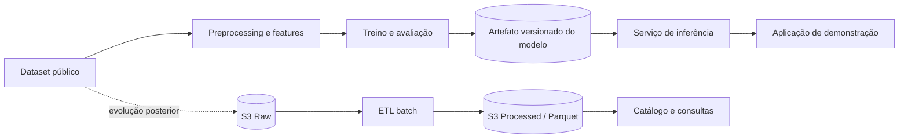

# NetGuard ML — Detecção de Ataques em Redes

Projeto de portfólio para detectar tráfego de rede suspeito com Machine Learning e, progressivamente, aplicar práticas de Data Engineering na AWS.

O objetivo inicial é classificar cada observação em uma das duas classes abaixo:

- `normal`
- `attack`

O projeto prioriza uma evolução verificável: primeiro um pipeline de ML reproduzível e avaliado; depois, quando houver uma necessidade arquitetural real, Data Lake, processamento batch, inferência e streaming.

> **Status atual:** planejamento e seleção do dataset. Não há dataset selecionado, pipeline de ML, modelo treinado, infraestrutura AWS, API ou dashboard implementados.

## Problema

Ataques podem alterar padrões de tráfego, como taxas de pacotes, volume de bytes, duração de conexões e taxas de erro. O NetGuard ML investigará se essas características permitem distinguir comportamento normal de comportamento sob ataque.

Accuracy não será usada isoladamente: o projeto dará atenção especial ao recall da classe `attack`, aos falsos negativos e aos falsos positivos.

## Arquitetura atual

Ainda não existe uma arquitetura de execução ou serviço implantado. O repositório contém somente documentação e a estrutura inicial para o futuro pipeline Python.


## Arquitetura planejada

Esta arquitetura é uma visão de evolução; seus componentes não estão implementados nesta etapa.



## Tecnologias

| Área | Atual | Planejado, quando necessário |
| --- | --- | --- |
| Linguagem e dados | Documentação Markdown | Python, pandas, NumPy e SQL |
| Machine Learning | Não implementado | scikit-learn; possível XGBoost e SHAP |
| Armazenamento analítico | Não implementado | Amazon S3, Parquet, AWS Glue Data Catalog e Athena |
| Orquestração batch | Não implementado | Scripts Python; Step Functions somente se a complexidade justificar |
| Infraestrutura | Não implementada | Terraform, IAM e recursos AWS necessários por fase |
| Inferência e aplicação | Não implementado | FastAPI, backend TypeScript e React/Next.js após validação do ML |
| Streaming e observabilidade | Não implementado | Kinesis e CloudWatch após o pipeline batch e a inferência |

## Status atual

- [ ] Selecionar e documentar um dataset público de tráfego de rede
- [ ] Realizar análise exploratória e definir o target binário
- [ ] Implementar preprocessing reproduzível
- [ ] Treinar e avaliar o baseline com Decision Tree
- [ ] Comparar Random Forest e boosting
- [ ] Exportar o modelo e o preprocessing versionados
- [ ] Evoluir para Data Engineering na AWS
- [ ] Criar inferência, streaming e dashboard

## Pipeline de dados

O pipeline ainda não foi implementado. A primeira versão local será definida após a escolha do dataset:

```text
Dataset → validação → limpeza → features → divisão treino/validação/teste
```

A divisão deverá evitar vazamento de dados. Se o dataset não tiver tempo real ou grupos confiáveis (por exemplo, host, sessão ou captura), a ordem das linhas não será usada como informação temporal. Janelas temporais só serão avaliadas se houver timestamps e uma sequência temporal significativa.

Posteriormente, o mesmo fluxo poderá evoluir para um Data Lake:

```text
Dataset → S3 Raw → transformação batch → S3 Processed (Parquet) → Glue Catalog → Athena
```

Consulte o [roadmap AWS](docs/aws-roadmap.md) para os critérios de entrada e o escopo de cada fase.

## Pipeline de Machine Learning

O experimento seguirá a sequência abaixo, com a mesma estratégia de divisão para todos os modelos:

```text
Decision Tree (baseline) → Random Forest → Boosting → comparação → seleção → exportação
```

As métricas incluirão accuracy, precision, recall, F1-score, false positive rate, false negative rate, matriz de confusão e tempos de treinamento e inferência. O artefato escolhido deverá incluir ou referenciar de forma versionada o preprocessing usado no treino.

## Arquitetura AWS

AWS não faz parte da arquitetura atual. Ela será introduzida apenas depois que o pipeline local estiver funcional, reproduzível e avaliado.

As fases previstas são:

1. Data Lake com S3, Glue Data Catalog e Athena;
2. processamento batch, validação e transformação;
3. integração entre pipeline de dados e treinamento de ML;
4. streaming com Kinesis, após a inferência estar validada;
5. observabilidade com CloudWatch.

A infraestrutura será provisionada preferencialmente com Terraform, sem antecipar recursos ou arquivos ainda não utilizados. Veja os detalhes em [Roadmap de Data Engineering e AWS](docs/aws-roadmap.md).

## Resultados

Ainda não há resultados experimentais. Esta seção passará a registrar, a cada experimento relevante:

- dataset e versão utilizados;
- definição de target e features;
- estratégia de divisão e avaliação de vazamento;
- métricas por modelo;
- análise de falsos positivos e falsos negativos;
- decisão e limitações conhecidas.

## Roadmap

| Marco | Entrega | Estado |
| --- | --- | --- |
| v0.1.0 | Dataset, preprocessing e baseline de ML | Pendente |
| v0.2.0 | Comparação de modelos e análise de erros | Pendente |
| v0.3.0 | Data Lake na AWS | Pendente |
| v0.4.0 | Pipeline batch de dados | Pendente |
| v0.5.0 | Inferência em tempo real | Pendente |
| v1.0.0 | Demonstração integrada | Pendente |

Releases serão criadas apenas quando esses marcos tiverem entregas verificáveis.

## Como executar localmente

Não há aplicação executável nesta fase. Para acompanhar ou contribuir com o planejamento:

```bash
git clone https://github.com/g-tavares14/netguard-ml.git
cd netguard-ml
```

O primeiro procedimento executável será adicionado junto com o dataset selecionado e a análise exploratória. Datasets, credenciais e artefatos de modelo não devem ser commitados.

## Infraestrutura

Não há recursos AWS nem código Terraform no repositório neste momento. Quando a fase de Data Lake for iniciada, a infraestrutura será adicionada incrementalmente em `infra/terraform/`, somente com os arquivos necessários à entrega corrente.

## Documentação

- [Escopo inicial do projeto](docs/escopo-inicial.md): objetivos, estratégia experimental, métricas e arquitetura de demonstração.
- [Roadmap de Data Engineering e AWS](docs/aws-roadmap.md): critérios e evolução planejada para Data Lake, batch, streaming e observabilidade.
- [Diretrizes para agentes](AGENTS.md): regras de execução e ordem técnica do projeto.

## Próxima entrega

`[Data] Select network traffic dataset`: selecionar uma fonte pública, avaliar seus rótulos, features, qualidade, distribuição de classes, timestamps e riscos de vazamento antes de definir o primeiro pipeline.
