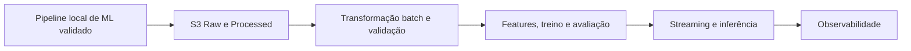

# Roadmap de Data Engineering e AWS

## Estado atual

Nenhum serviço AWS, recurso Terraform ou pipeline de dados em nuvem foi implementado. Esta página documenta uma evolução planejada e não deve ser interpretada como arquitetura em produção.

## Princípio de adoção

AWS será introduzida para resolver uma necessidade real do projeto, e não para aumentar artificialmente o número de tecnologias usadas. A condição de entrada para qualquer trabalho de infraestrutura é a existência de um pipeline local de ML funcional, reproduzível e avaliado.

Antes disso, o foco permanece em:

```text
CICIoT2023 subsample → análise exploratória → preprocessing → baseline → avaliação e comparação
```

## Visão de evolução



## Fase 1 — Data Lake

### Objetivo

Armazenar dados brutos e dados transformados de forma consultável e reproduzível.

### Componentes previstos

- Amazon S3 com zonas `raw` e `processed`;
- transformação para formato colunar, preferencialmente Parquet;
- AWS Glue para ETL ou catálogo, conforme a necessidade comprovada;
- Glue Data Catalog;
- Amazon Athena para consultas analíticas;
- IAM com permissões mínimas necessárias.

### Fluxo conceitual

```text
Dataset → S3 Raw → Glue/ETL → S3 Processed → Glue Catalog → Athena
```

### Critérios de aceitação

- dados raw e processed identificáveis por versão/origem;
- dados processed em formato documentado e adequado a consultas;
- esquema catalogado e ao menos uma consulta Athena reproduzível;
- permissões IAM restritas ao necessário;
- custos e política de retenção documentados.

### Fora do escopo

- streaming, dashboard, múltiplos ambientes e microserviços.

## Fase 2 — Pipeline batch

### Objetivo

Tornar a ingestão e a transformação dos dados repetíveis, observáveis e testáveis.

### Capacidades previstas

- validação de esquema e qualidade dos dados;
- limpeza e transformações;
- feature engineering compatível com o treinamento;
- versionamento de entradas e saídas;
- execução batch agendada ou sob demanda.

Scripts Python serão preferidos enquanto forem suficientes. AWS Step Functions só será avaliado quando houver múltiplas etapas, dependências, retentativas ou estados que justifiquem uma orquestração explícita. Lambda será usada apenas para tarefas pequenas, idempotentes e adequadas ao modelo serverless.

## Fase 3 — Integração com Machine Learning

### Objetivo

Conectar os dados processados a um fluxo de treinamento reproduzível, mantendo treinamento separado da inferência.

```text
Raw Data → Processing → Features → Training → Evaluation → Model Artifact
```

### Requisitos

- o modelo e o preprocessing usam versões identificáveis dos dados e do código;
- o artefato do modelo carrega ou referencia o preprocessing versionado;
- a avaliação registra métricas, estratégia de divisão e risco de vazamento;
- não há contrato de API definitivo antes da definição das features de produção.

## Fase 4 — Streaming

### Condição de entrada

O pipeline batch, o modelo e o contrato de inferência precisam estar funcionais e avaliados.

### Componentes previstos

- simulador de tráfego;
- Amazon Kinesis para ingestão de eventos;
- consumidor/processador de eventos;
- inferência com o modelo validado;
- persistência histórica no S3;
- atualização da demonstração visual.

```text
Traffic Simulator → Kinesis → Processing → ML Inference → Dashboard
Kinesis → S3 → Data Lake → Analytics
```

O projeto não exibirá um tipo específico de ataque na demonstração a menos que o modelo tenha sido treinado e avaliado para essa classificação.

## Fase 5 — Observabilidade

CloudWatch será incorporado onde houver componentes em execução para registrar logs, erros e métricas úteis, incluindo latência, volume processado, falhas e, quando aplicável, alarmes. Observabilidade não será simulada como infraestrutura isolada antes de existir uma carga de trabalho que a utilize.

## Infrastructure as Code

Terraform será a forma preferencial de provisionamento. A estrutura inicial será criada somente na Fase 1, acrescentando arquivos de forma incremental conforme os recursos entram em uso. Uma organização possível é:

```text
infra/terraform/
├── main.tf
├── variables.tf
├── outputs.tf
├── s3.tf
├── iam.tf
├── glue.tf
└── athena.tf
```

Arquivos para Lambda, Step Functions, Kinesis e CloudWatch serão adicionados apenas em suas fases correspondentes. Estado Terraform, credenciais, dados grandes e artefatos de modelo não serão versionados no Git.

## Como manter este roadmap atualizado

Ao concluir um marco, atualize esta página e o README com:

1. o que foi implementado e o que continua planejado;
2. decisões de arquitetura e suas justificativas;
3. recursos AWS efetivamente utilizados;
4. evidências de validação, como consultas, testes ou métricas;
5. custos, limitações e próximos passos relevantes.

Cada mudança de dados, features ou modelos deve também registrar o contexto experimental no Pull Request, conforme o template do repositório.
