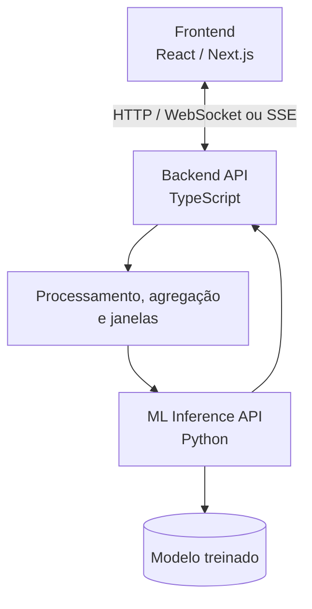

# Escopo inicial do projeto

[← Voltar ao README](../README.md) | [Dataset Oficial](dataset.md) | [Roadmap AWS](aws-roadmap.md)

## 1. Objetivo e critérios de sucesso

O NetGuard ML deverá analisar métricas de tráfego e classificar o estado da rede inicialmente como **normal** ou **sob ataque**. A proposta inclui tanto o desenvolvimento do classificador quanto a experimentação necessária para entender seus limites e demonstrar seu funcionamento.

O projeto será considerado bem-sucedido quando:

- houver um pipeline reproduzível de limpeza, preparação, treinamento e avaliação;
- os modelos forem comparados sobre as mesmas divisões de dados;
- os resultados incluírem métricas adequadas a classes desbalanceadas;
- for possível justificar as principais decisões do modelo;
- existir, após a validação do pipeline de ML, uma demonstração integrada de inferência.

## 2. Dataset

O dataset oficial é o **CICIoT2023** (Neto et al., 2023), na distribuição HuggingFace `lacg030175/CIC-IoT-2023-neto-subsample`, config `random_3way`. Detalhes, splits e citação: [Dataset Oficial](dataset.md).


A fonte atende aos critérios abaixo: tráfego de rede público e rotulado, target binário (`label` 0/1), ICMP e ping flood (`DDoS-ICMP_Flood` e afins), e tamanho adequado ao treino local. Não substitui o artigo do CIC — o HuggingFace é o recorte de trabalho, não um dataset novo.

Neste fonte as features são as 46 colunas de Fluxo do CICIoT (duração, taxa, flags TCP, indicadores de protocolo incluindo `ICMP`, tamanhos, IAT, estatísticas). **Não há** tipo/código ICMP, taxa de echo request/reply nem latência de ping. ICMP entra como indicador `ICMP` (0/1) e como `Label` (`DDoS-ICMP_Flood`, `DDoS-ICMP_Fragmentation`, `Recon-PingSweep`). Achados: [EDA](eda.md).

A análise exploratória cobre esses pontos em [eda.md](eda.md): schema, categorias de ataque, distribuição Normal/Attack (aqui Attack é maioria), nulos/duplicatas/constantes, recomendações de escala, ausência de timestamp e vazamento entre Splits.

O target inicial será binário. Os diferentes tipos de ataque, inclusive ping flood / ICMP flood, poderão ser agrupados na classe `attack`, desde que os rótulos do dataset permitam esse mapeamento de forma clara e documentada. Um tipo específico de ataque ICMP só deverá aparecer na saída se o modelo tiver sido treinado e avaliado para isso.

> **Janelas temporais não se aplicam a este fonte.** Não há relógio de captura; `IAT` não é timestamp; a ordem das linhas não é tempo. O classificador responde se **este Fluxo** é Normal ou Attack. Janelas só voltam se houver outra fonte com ordenação temporal real.

## 3. Estratégia de Machine Learning

### 3.1 Decision Tree — baseline

A Decision Tree será o primeiro modelo. Ela oferece treinamento rápido, regras fáceis de visualizar e uma referência simples para avaliar abordagens posteriores.

Suas principais limitações são a tendência ao overfitting e a possibilidade de criar regras excessivamente específicas ao dataset. Profundidade, quantidade mínima de amostras por folha e pesos de classe deverão ser controlados durante os experimentos.

### 3.2 Random Forest

A Random Forest combinará diversas árvores treinadas com amostras e subconjuntos de features diferentes. A hipótese experimental é que essa combinação generalize melhor que a árvore individual, em troca de maior custo computacional e menor transparência direta.

### 3.3 Boosting

Um algoritmo de boosting, como XGBoost, poderá ser incluído se as restrições da disciplina e do ambiente permitirem. O modelo será treinado sequencialmente para corrigir erros anteriores e comparado sob o mesmo protocolo dos demais.

A sequência experimental será:

```text
Decision Tree → Random Forest → Boosting
```

O objetivo não é selecionar o modelo apenas pela maior accuracy, mas compreender os trade-offs entre qualidade, custo, explicabilidade e risco operacional.

## 4. Avaliação e comparação

Todos os modelos deverão usar os Splits publicados (`train` / `validation` / `test`). Não há ordenação temporal neste fonte e não há ID de sessão/host no schema. A EDA mediu duplicatas de Fluxo entre Splits; o preprocessing deverá tratá-las sem reembaralhar o corpus.

As métricas previstas são:

- accuracy;
- precision;
- recall;
- F1-score;
- false positive rate;
- false negative rate;
- matriz de confusão;
- tempo de treinamento;
- tempo de inferência.

Accuracy não será usada isoladamente. Neste subsample o Attack é maioria (~86% no train): um classificador que sempre responda `attack` teria accuracy alta e recall de Attack alto, e ainda seria inútil. Recall da classe Attack e falsos negativos continuam no centro, sem ignorar falsos positivos (Normal classificado como Attack).

## 5. Análise temporal

Não se aplica ao Subsample CICIoT. Cada linha já é um Fluxo agregado; não existe timestamp de captura. Agregar esses Fluxos em “N segundos” inventaria tempo a partir da ordem das linhas.

A pergunta permanece: **este Fluxo é Normal ou Attack?** Janelas de N segundos só voltam se no futuro houver outra fonte com relógio real.

## 6. Explicabilidade e análise de erros

As predições deverão ser acompanhadas, quando tecnicamente possível, dos fatores que mais influenciaram o resultado. Serão avaliadas:

- feature importance nativa dos modelos;
- permutation importance sobre dados de validação ou teste;
- SHAP, caso o custo e a compatibilidade sejam adequados aos modelos escolhidos.

Uma resposta apresentada ao usuário poderá seguir este formato conceitual:

```text
ATTACK — 94%

Principais fatores:
1. aumento anormal da taxa de pacotes;
2. crescimento repentino de conexões;
3. alteração significativa da variância de latência.
```

A análise também deverá examinar falsos positivos e falsos negativos para identificar tipos de ataque, padrões de tráfego ou intervalos de valores nos quais os modelos falham com maior frequência.

## 7. Arquitetura proposta



### 7.1 Backend TypeScript

O backend principal será responsável por:

- receber e validar dados;
- organizar o fluxo da aplicação;
- agregar eventos e construir janelas temporais **somente se** a fonte de produção tiver tempo real (não é o caso deste subsample);
- persistir informações necessárias;
- comunicar-se com o serviço de ML;
- entregar resultados ao frontend;
- publicar atualizações por WebSocket ou Server-Sent Events.

Fastify, NestJS ou tecnologia equivalente poderá ser escolhida depois da validação do pipeline. A separação do backend não pressupõe que TypeScript seja automaticamente mais rápido que Python; seu principal benefício será arquitetural.

### 7.2 Serviço de Machine Learning em Python

O ecossistema Python será utilizado para:

- análise e preparação dos dados;
- treinamento e avaliação;
- scikit-learn, Polars, pandas e NumPy;
- possível uso de XGBoost e SHAP;
- carregamento do artefato treinado e inferência.

FastAPI é uma opção para expor o serviço, mas ainda não é uma decisão definitiva.

Uma interface conceitual de inferência seria:

```http
POST /predict
```

```json
{
  "packet_rate": 1842,
  "mean_latency": 82.4,
  "latency_std_dev": 31.2,
  "connection_rate": 421
}
```

```json
{
  "prediction": "attack",
  "probability": 0.94
}
```

Os nomes dos campos, tipos, validações e formato da resposta somente serão transformados em contrato definitivo depois que o dataset e o pipeline de features forem definidos.

## 8. Pipeline de treinamento

O treinamento será executado separadamente da API de inferência:


O artefato exportado deverá carregar junto, ou referenciar de forma versionada, todo o preprocessing exigido na inferência. Isso evita diferenças entre a transformação aplicada durante o treinamento e aquela aplicada em produção.

## 9. Demonstração em tempo real

Após a validação do modelo, um simulador produzirá eventos normais e anômalos para a demonstração, inclusive tráfego ICMP normal (`ping`) e inundação por ping, se o modelo tiver sido treinado com essas características:

```text
Simulador → API TypeScript → (Fluxo; janela só com fonte temporal) → Serviço Python → Predição → Dashboard
```

O dashboard poderá exibir:

- estado atual da rede;
- probabilidade estimada de ataque;
- métricas recentes, como latência, pacotes, conexões por segundo e, quando disponível, taxa de ICMP;
- comportamento detectado;
- principais fatores associados à predição.

A classificação de um tipo específico, como DoS ou ICMP flood, somente será apresentada se o modelo tiver sido treinado e avaliado para produzir esse resultado. Caso contrário, o dashboard mostrará apenas a classe binária e uma descrição prudente dos sinais observados.

## 10. Escalabilidade

A separação entre backend e inferência permite que os componentes evoluam e sejam escalados de forma independente. Se a inferência se tornar o gargalo, múltiplas instâncias do serviço Python poderão ser executadas atrás de um balanceador.

Essa possibilidade será tratada como evolução futura. Para o projeto acadêmico, a arquitetura serve principalmente para separar responsabilidades; microserviços, múltiplas instâncias e infraestrutura distribuída não serão introduzidos apenas para aumentar a complexidade.

## 11. Estrutura experimental e apresentação

A apresentação contará uma história progressiva:

1. problema e motivação;
2. dataset e análise exploratória;
3. Decision Tree como baseline;
4. Random Forest;
5. boosting;
6. comparação dos modelos;
7. análise temporal, se suportada pelos dados;
8. explicabilidade e análise de erros;
9. arquitetura da aplicação;
10. demonstração em tempo real.

Assim, o resultado não ficará limitado a uma medida de accuracy: deverá demonstrar experimentação, decisões de engenharia e comportamento do sistema.

## 12. Prioridades e roadmap

### Prioridade 1 — Obrigatório

```text
Dataset → preprocessing → baseline → treinamento → avaliação
```

### Prioridade 2 — Diferencial

```text
Comparação de modelos → análise de erros → explicabilidade
```

### Prioridade 3 — Demonstração

```text
API Python → API TypeScript → simulador → dashboard
```

### Prioridade 4 — Se houver tempo

```text
Containers → múltiplas instâncias → testes de carga → métricas de latência → análise de escalabilidade
```

## 13. Próximos passos

1. ~~Escolher o dataset~~ — CICIoT2023 subsample HuggingFace; ver [Dataset Oficial](dataset.md).
2. ~~Realizar a análise exploratória~~ — [eda.md](eda.md).
3. ~~Definir o target~~ — `label` 0/1 → Normal/Attack.
4. ~~Identificar features e vazamento~~ — 46 features de Fluxo; duplicatas entre Splits medidas na EDA.
5. ~~Análise temporal~~ — não neste fonte.
6. Usar os splits publicados (`train` / `validation` / `test`) e as métricas do escopo.
7. Implementar preprocessing reproduzível, depois a Decision Tree como baseline.
8. Implementar e avaliar a Random Forest.
9. Avaliar um modelo de boosting.
10. Comparar resultados e analisar os erros.
11. Selecionar e exportar o modelo.
12. Somente então iniciar a arquitetura de demonstração.

> **Decisão de execução:** o projeto não começará pelos microserviços. Primeiro será comprovado que o pipeline de ML funciona; depois, o modelo validado será transformado em serviço.
